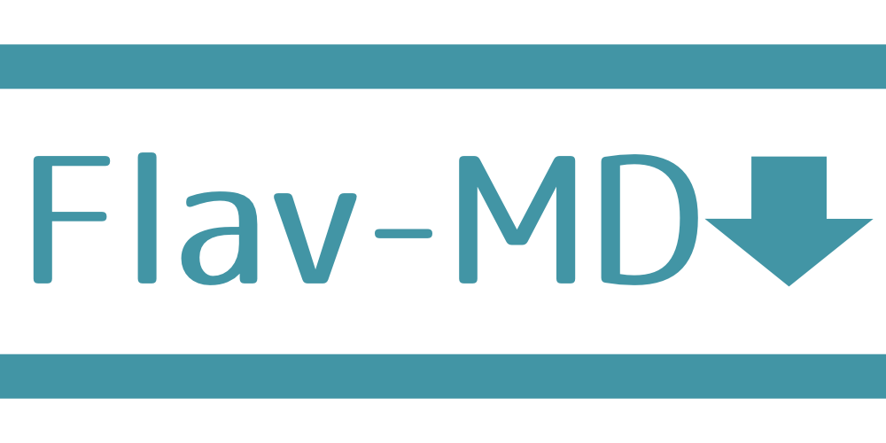

# flav-md


markdown parser with css style

## About

flav-md is a lightweight and flexible Markdown parser that converts Markdown to HTML with automatic CSS class generation. Unlike other Markdown parsers, flav-md adds semantic CSS classes to every HTML element, making it incredibly easy to style the output with CSS.

### Key Features

- 🚀 **Lightweight** - Minimal dependencies and fast parsing
- 🎨 **CSS-Ready** - Automatic CSS class generation for all elements
- 📝 **Full Markdown Support** - Headers, lists, links, images, code blocks, tables, and more
- 🔧 **Easy Integration** - Works with Node.js, ES6, and TypeScript
- 💾 **Flexible Input** - Read from files or strings
- 🎯 **Semantic Classes** - Predictable and consistent class naming

### Use Cases

- **Documentation sites** - Generate styled docs from Markdown
- **Blog systems** - Convert posts with custom styling
- **Static site generators** - Build sites with Markdown content
- **Content management** - Process user-generated Markdown content
## How to use
### install
You can install via npm with
```bash
npm install flav-md
```

### Basic Usage

CommonJS
```js
const { createFlavMd } = require('flav-md');

const result = createFlavMd()
  .readMdText('# Hello World')
  .readCssText('.flav-md-h1 { color: red; }')
  .build();
```

ES6 or TypeScript
```ts
import { createFlavMd } from 'flav-md';

const result = createFlavMd()
  .readMdText('# Hello World')
  .readCssText('.flav-md-h1 { color: red; }')
  .build();
```

### Working with Files

If you need to read from files, use Node.js file system utilities:

```ts
import { readFileSync } from 'fs';
import { createFlavMd } from 'flav-md';

const markdownContent = readFileSync('example.md', 'utf-8');
const cssContent = readFileSync('example.css', 'utf-8');

const result = createFlavMd()
  .readMdText(markdownContent)
  .readCssText(cssContent)
  .build();
```

## Documentation

### CSS Classes

flav-md automatically generates CSS classes for all HTML elements. For a complete reference of all available CSS classes and styling examples, see:

- **[CSS Class Reference](./CSS-Class-Wiki.md)** - Complete guide to all CSS classes
- **[GitHub Wiki](https://github.com/jiko21/flav-md/wiki/CSS-class-name-for-flav-md)** - Additional documentation

### Examples

Check out the [examples](./examples/) directory for sample Markdown files and CSS styling.

### API Reference

#### `createFlavMd()`
Creates a new FlavMd instance.

```typescript
const flavmd = createFlavMd();
```

#### `.readMdText(mdText: string)`
Reads Markdown content from a string and parses it to HTML.

```typescript
flavmd.readMdText('# Hello World\n\nThis is **bold** text.');
```

#### `.readCssText(cssText: string)`
Reads CSS content from a string to be embedded in the final HTML.

```typescript
flavmd.readCssText('.flav-md-h1 { color: blue; font-size: 2em; }');
```

#### `.build()`
Generates the final HTML with embedded CSS.

```typescript
const html = flavmd.build();
```

## Contributing

Contributions are welcome! Please feel free to submit a Pull Request.

## License

MIT © [jiko21](https://github.com/jiko21)
